<p align="center">
  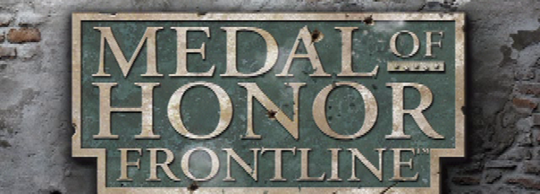
</p>

<h1 align="center">MOH Frontline — PS2 Static Recompilation</h1>

<p align="center">
  A native PC port of <b>Medal of Honor: Frontline</b> (PlayStation 2, <code>SLUS_203.68</code>)<br>
  built by <i>static recompilation</i> rather than emulation.
</p>

---

The game's MIPS R5900 code is translated ahead of time into C++, compiled into an
ordinary native executable, and run against a hand-written implementation of the
PlayStation 2 hardware it talks to — VU0/VU1, the Graphics Synthesizer, VIF1, the
DMA controller and the I/O processor.

Built on [ran-j/PS2Recomp](https://github.com/ran-j/PS2Recomp). This repository is
the Frontline-specific fork: the runtime work and the notes behind it.

> **You must supply your own copy of the game.** No disc image, no extracted
> assets and no recompiled game code are distributed here — the recompiler
> regenerates them locally from a disc you own.

---

## Progress

Everything below is rendered by this port: no emulator, no original executable —
recompiled game code driving a software Graphics Synthesizer.

<table>
<tr>
<td width="50%"></td>
<td width="50%">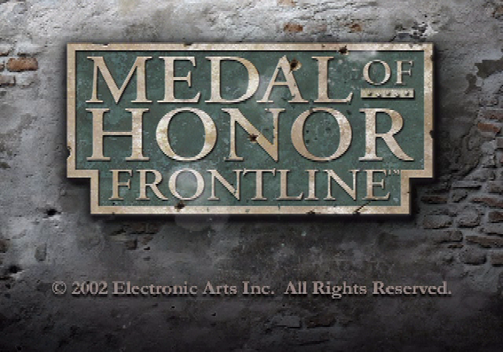</td>
</tr>
<tr>
<td><b>Cold boot.</b> The publisher logo plays from the game's own video stream, with audio.</td>
<td><b>Title screen.</b> Textured plaque, alpha blending and the front-end font pipeline.</td>
</tr>
<tr>
<td>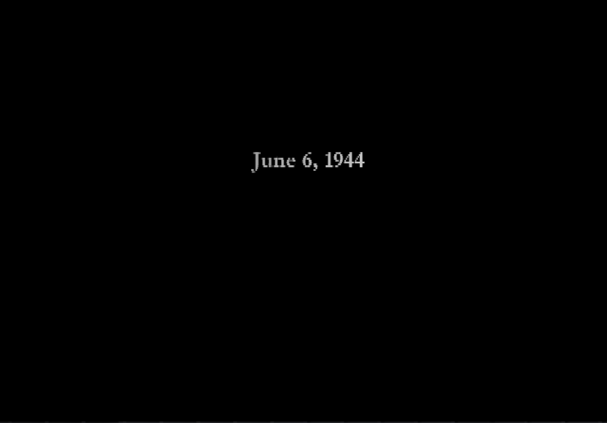</td>
<td>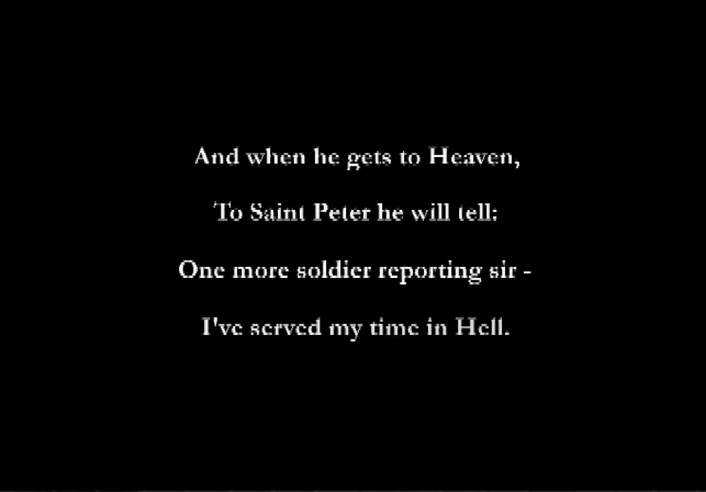</td>
</tr>
<tr>
<td colspan="2"><b>Level opening.</b> "Your Finest Hour" opens on its date card and text, over the soundtrack.</td>
</tr>
<tr>
<td>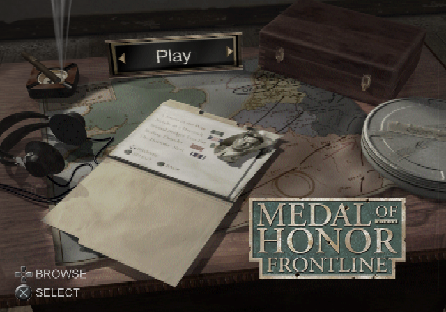</td>
<td>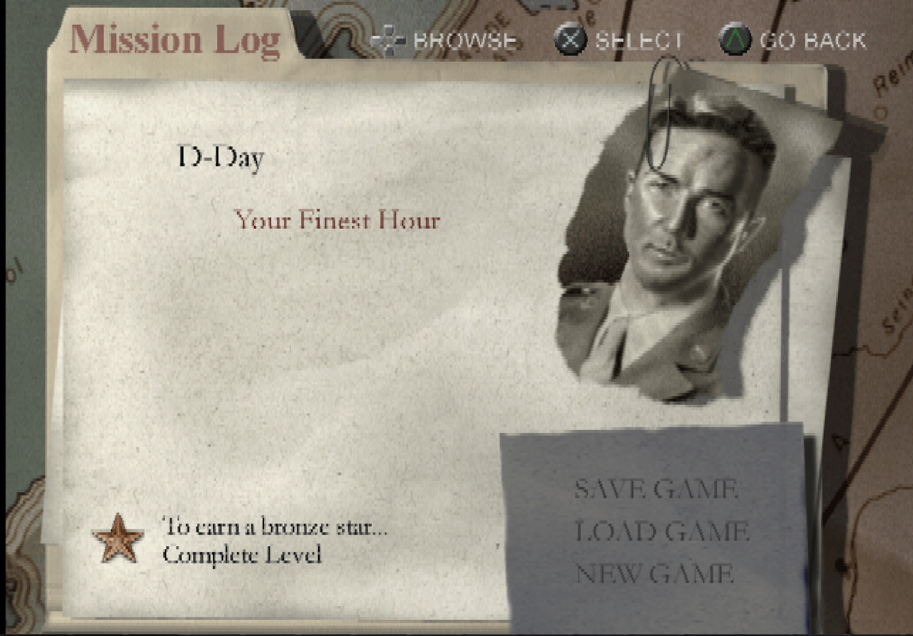</td>
</tr>
<tr>
<td><b>Main menu.</b> The campaign desk, with its map, compass and layered paper sprites.</td>
<td><b>Mission Log.</b> Mission detail, medal criteria and save/load entries.</td>
</tr>
<tr>
<td>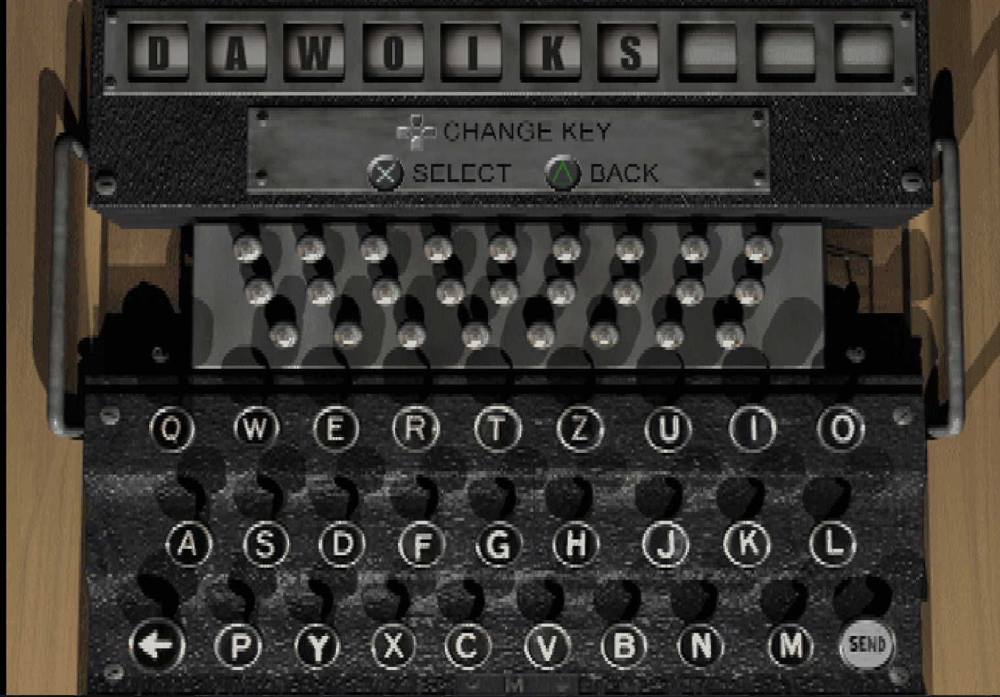</td>
<td>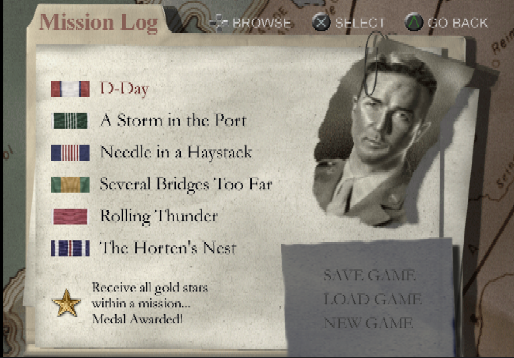</td>
</tr>
<tr>
<td><b>Code entry.</b> The Enigma machine screen, here with the retail <code>DAWOIKS</code> cheat.</td>
<td><b>…and it takes.</b> All six campaigns unlocked, so the whole mission tree is reachable.</td>
</tr>
<tr>
<td>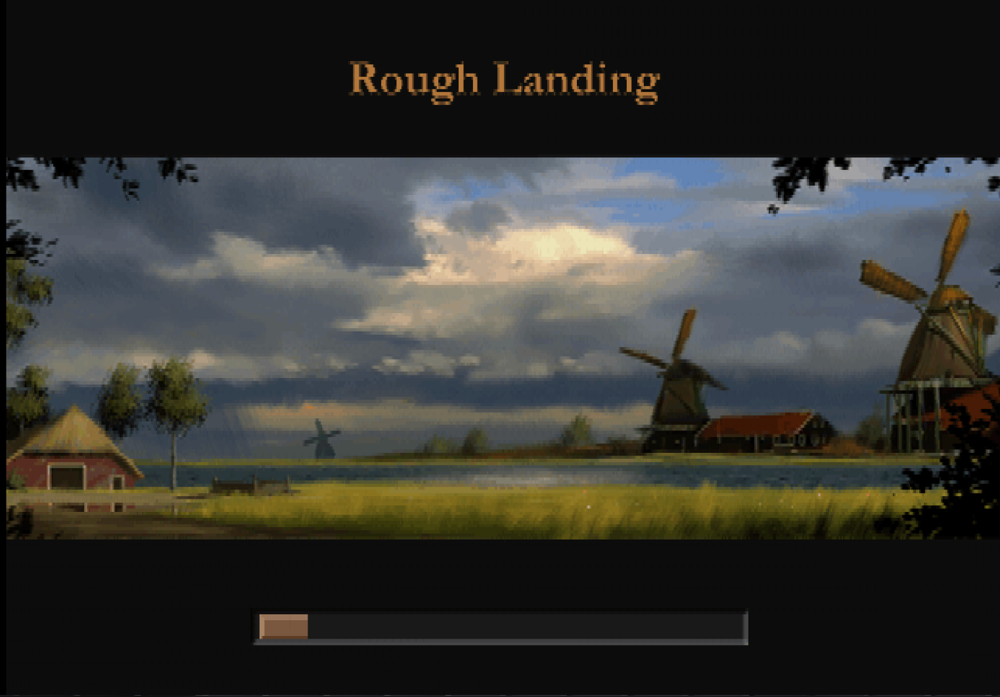</td>
<td>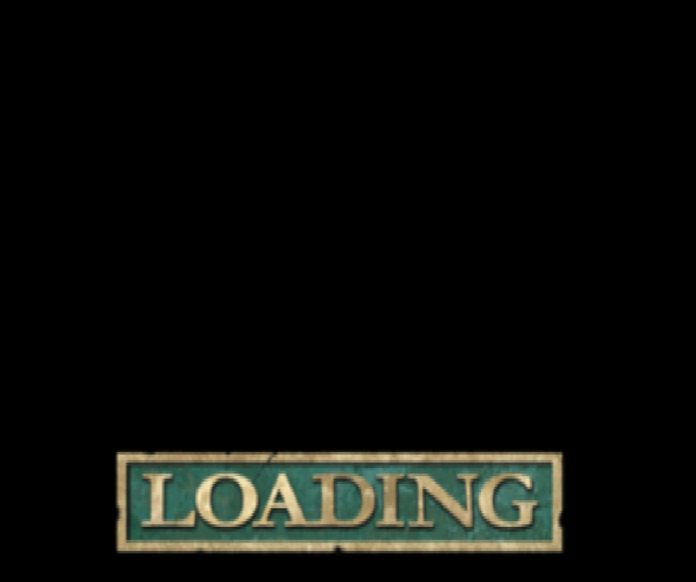</td>
</tr>
<tr>
<td><b>Level load.</b> "Rough Landing" — mission title, artwork and a live progress bar.</td>
<td><b>Loading banner.</b> The between-screens transition.</td>
</tr>
<tr>
<td colspan="2">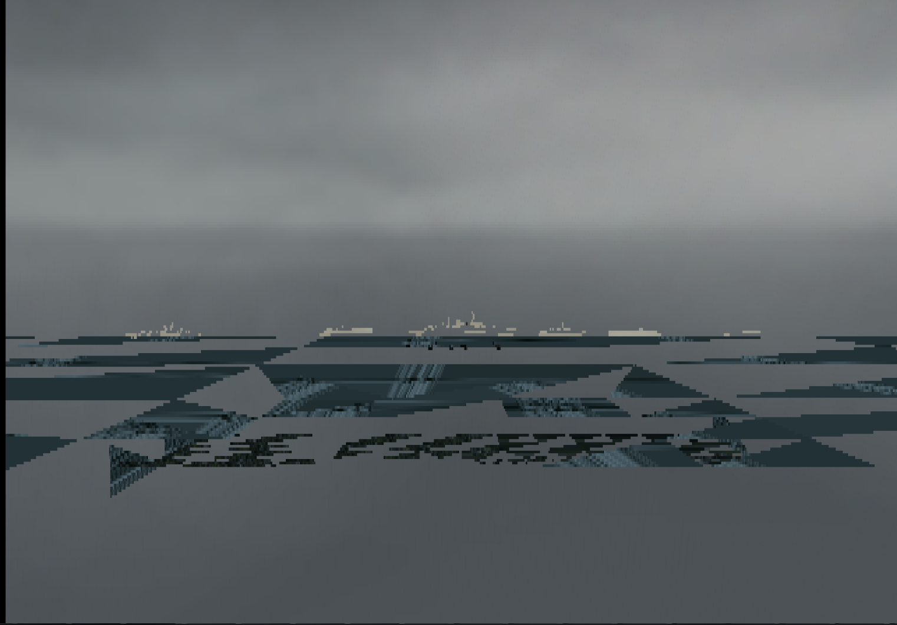</td>
</tr>
<tr>
<td colspan="2"><b>In engine.</b> The invasion fleet off Omaha Beach — recompiled game code driving a
software Graphics Synthesizer. The banding across the water is the open defect below.</td>
</tr>
</table>

**Working**

- Cold boot through the publisher logos and the intro movie — video and audio.
- Front-end: title screen, main menu, Mission Log, briefing screens, fonts, HUD sprites.
- Code entry via the Enigma screen, including the retail level-unlock cheat.
- Mission load, loading screens, and the first 3D scene with textures, fog and Z-buffering.
- Streaming music and sound effects through the IOP HLE layer.
- VU0 macro mode, VU1 microprogram interpretation, VIF1 unpack, GIF PATH1/2/3.

**Open defect — off-screen geometry**

In 3D scenes, large sheared triangles cover the view. The cause is localised:
Frontline does no geometric clipping in VU1. Its microprogram instead tests the
clip-flag register and, for any primitive touching the frustum, sets the **ADC
bit** (bit 111 of the packed vertex qword) so the GS kicks the vertex without
drawing it. One of the three resident VU1 microprograms drives that path
correctly here; another emits millions of out-of-frustum vertices with ADC clear,
and those are what get drawn. See the [technical notes](docs/TECHNICAL-NOTES.md).

---

## How it is put together

```
ps2xAnalyzer   scans the ELF, exports a function map (Ghidra-assisted)
ps2xRecomp     decodes R5900 and emits one C++ function per game function
ps2xRuntime    the PS2 that generated code runs against
ps2xIOP        HLE for the I/O processor: CD/DVD, memory card, SPU2, RPC
```

`ps2xRuntime` is where the port work lives — roughly 95 000 lines across 120
files. The parts that mattered most for Frontline:

| Area | File |
|---|---|
| VU1 microprogram interpreter (upper/lower pipelines, clip flags, DIV latency) | `src/lib/vu/ps2_vu1_*.cpp` |
| Graphics Synthesizer register file and GIF packet decode | `src/lib/ps2_gs_gpu.cpp` |
| Software rasterizer (triangles, sprites, texturing, Z, alpha) | `src/lib/ps2_gs_rasterizer.cpp` |
| VIF1 command stream, UNPACK, MPG microcode upload | `src/lib/ps2_vif1_interpreter.cpp` |
| Guest memory, DMA tag walking, scratchpad | `src/lib/ps2_memory.cpp` |
| Per-title runtime patches keyed by ELF metadata | `src/lib/game_overrides.cpp` |

---

## Building

Requires CMake 3.20+, a C++20 compiler, and a host with SSE4.

```bash
git clone --recurse-submodules https://github.com/ant0-blase/MOHFrontline-PS2Recomp.git
cd MOHFrontline-PS2Recomp
cmake -S . -B build-runtime-launcher -DCMAKE_BUILD_TYPE=RelWithDebInfo
```

Then, with your own disc image:

1. Extract `SLUS_203.68` from the disc.
2. Export a function map from Ghidra with
   `ps2xAnalyzer/tools/ghidra/ExportPS2Functions.java`.
3. Recompile into `recomp/` using the configuration in `toml/`:
   ```bash
   ./ps2_recomp toml/launcher_recomp.toml
   ```
4. Build and run:
   ```bash
   cmake --build build-runtime-launcher --target ps2MOHFrontlineRunner -j$(nproc)
   ./build-runtime-launcher/ps2xRuntime/ps2MOHFrontlineRunner extracted/SLUS_203.68
   ```

`tools-moh-run-capture.sh` runs the game and screenshots the window at a fixed
interval. `tools-moh-verified-run.sh` wraps that and asserts the linked binary
actually contains the diagnostic probe being measured, so a result can always be
tied back to the build that produced it.

---

## Diagnostics

The runtime carries instrumentation probes, all off by default and all selected
by environment variable, so a hypothesis can be tested without editing code:

| Variable | Effect |
|---|---|
| `PS2_MOH_DIAG_SPAN_LIMIT=<px>` | Drop primitives wider than N pixels. Makes 3D scenes legible while the clip defect is open — but it also drops legitimate full-screen menu quads, so never use it on the front-end. |
| `PS2_MOH_DIAG_CLAMP_XY=1` | Clamp screen X/Y before `FTOI4` instead of letting the GS field wrap. |
| `PS2_MOH_DIAG_NO_TEXTURE=1` | Render flat, to separate geometry faults from texturing faults. |
| `PS2_MOH_VU_DIV_LATENCY=1` | Model VU `DIV`/`WAITQ` latency instead of retiring `Q` immediately. |
| `PS2_MOH_DIAG_NO_CF_MASK=1` | Disable the 24-bit clip-flag mask, for A/B testing. |

These are diagnostics, not fixes: none is enabled in a normal run, and none is
conditioned on a level, a frame or a colour.

---

## Technical notes

[`docs/TECHNICAL-NOTES.md`](docs/TECHNICAL-NOTES.md) covers the findings that cost
real time, with the measurements behind them. A few that generalise beyond this
game:

- **`FTOI` must saturate.** A plain C++ `float`→`int32_t` cast is undefined
  behaviour on overflow and flips sign on x86. This was *the* defect behind the
  broken 3D render; PS2 hardware saturates instead.
- **VU1 microcode banks are not stable.** Frontline rewrites each 0x800-byte bank
  ~86 times per run, cycling three distinct programs. Any statistic keyed on a
  VU1 address is meaningless unless tagged by `(bank, variant)`.
- **The GS `Q` register latches on `RGBAQ`,** not per vertex, in PACKED mode.
- **A triangle-strip vertex window must advance on non-drawing kicks too** —
  `XYZ3` and ADC-suppressed vertices still shift the window.

[`docs/SUBSYSTEM-MAP.md`](docs/SUBSYSTEM-MAP.md) maps the game's subsystems onto
ELF addresses, with the evidence for each label.

---

## Credits

- [PS2Recomp](https://github.com/ran-j/PS2Recomp) by ran-j — the recompiler and
  runtime foundation this fork is built on.
- Inspired by [N64Recomp](https://github.com/N64Recomp/N64Recomp).
- ELFIO, toml11 and fmt for parsing and formatting.

## Legal

*Medal of Honor: Frontline* is © 2002 Electronic Arts Inc. This project ships no
game code and no game assets: it is tooling plus an original reimplementation of
PS2 hardware behaviour, and it requires a disc you legally own. Recompiler output
is generated on your machine and excluded from this repository by `.gitignore`.
The screenshots above are captures of the port running, included to document its
state.
